# PB-007 non-technical-user UX audit

Audit date: 2026-09-01  
Build: locally assembled Twinotify `0.1.0` release APK, target SDK 36  
Device: `emulator-5558`, Android 17 / API 37, 1080 × 2400 at 420 dpi  
User goal: link two phones without an account, understand the permissions, and know whether mirroring is ready  
Access target: a first-time Android user who should not need to know what a relay, NSD, foreground service, or package setting is

## Outcome

The single-emulator journey is now understandable and completable through a real nearby-pairing QR/waiting state. The audit found and fixed one critical journey blocker: nearby onboarding did not request **Nearby devices**, so the primary local pairing path always ended in `wifi_permission_denied`. It also removed a premature `ACCESS_LOCAL_NETWORK` declaration; Android's current contract says target SDK 36 apps should use `NEARBY_WIFI_DEVICES` and must not request the Android 17 permission before targeting SDK 37.

The pass also corrected overbroad notification/privacy claims, made the battery-setting destination truthful, and gave every permission action a descriptive accessibility name and a 48 dp target. Two-phone outcomes, TalkBack behavior, physical notification surfaces, and OEM-specific background behavior remain unverified rather than inferred.

## What is already strong

- The first screen states the value, encryption, and no-account model in plain language.
- The role and connection choices are large, explicit, and reversible.
- System permission prompts appear only after a Twinotify rationale screen.
- The unpaired Home screen has one clear primary action and keeps its unavailable switch disabled.
- History starts empty, explains what appears there, and confirms destructive privacy changes before deleting saved content.
- Settings uses familiar names and keeps destructive actions away from the primary journey.
- The existing token system, primitive buttons, spacing, icon library, and type hierarchy remain visually consistent across the journey.

## Numbered journey review

### 1. Welcome — healthy

The page explains the product without infrastructure terms and offers one primary start action. “I already have a code” is understandable for a returning/joining phone, although the lack of a non-camera fallback is recorded separately in the backlog.

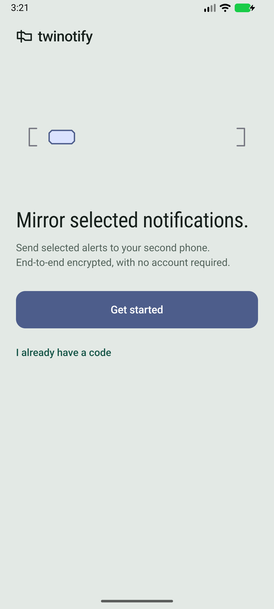

### 2. Explanation — fixed and healthy

The sequence remains short. “Mirror every notification” was inaccurate because app selection and filtering are part of the product; it now says “Mirror selected notifications.” The privacy slide now says that phones encrypt before sending and only paired phones can read the content, instead of implying the local app never processes it.

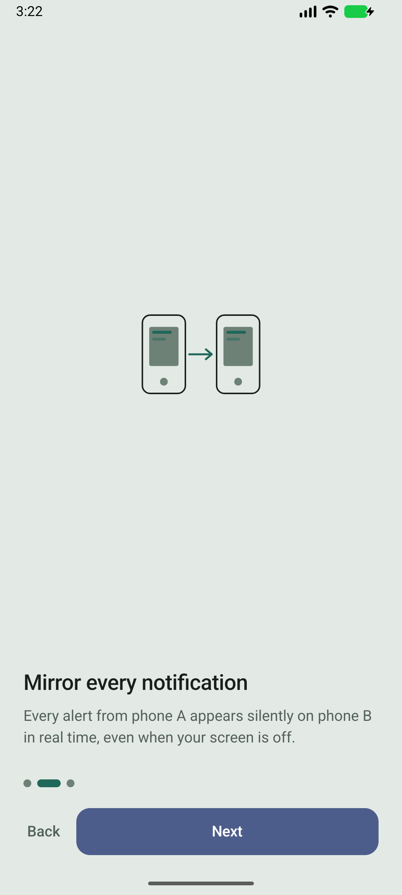

### 3. Role and connection choice — healthy, with one owner dependency

Both roles explain what the phone will do. Nearby pairing is usable without infrastructure knowledge. Relay pairing still expects a manually supplied server and therefore cannot be the default consumer path until PB-005's production hostname, operations, and privacy policy are approved.

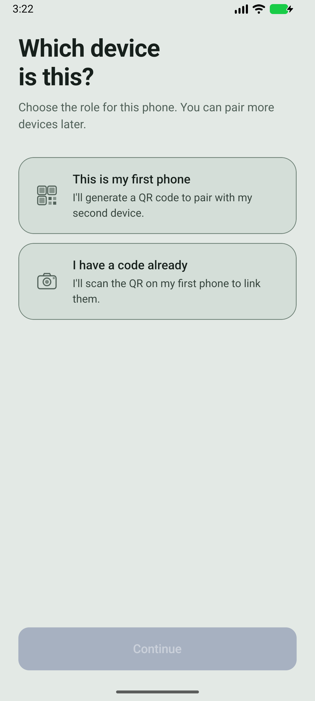

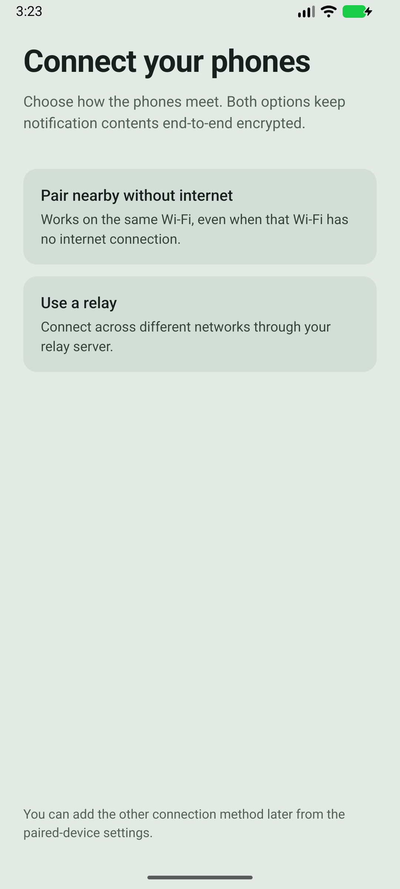

### 4. Permission rationale — critical blocker fixed

The pre-fix journey requested only notification posting and notification access even after nearby pairing was selected. Entering pairing then produced a dead-end permission error.

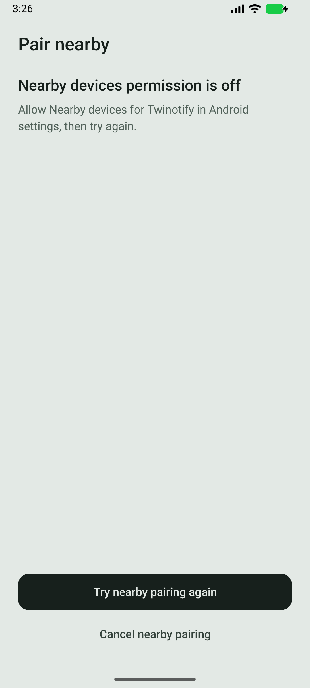

Nearby mode now presents three requirements, keeps **Continue** disabled until all three are granted, and omits nearby access from relay mode. The controls expose “Allow Post notifications,” “Open Notification access settings,” and “Allow Nearby devices” to the Android accessibility tree, each at 48 dp.

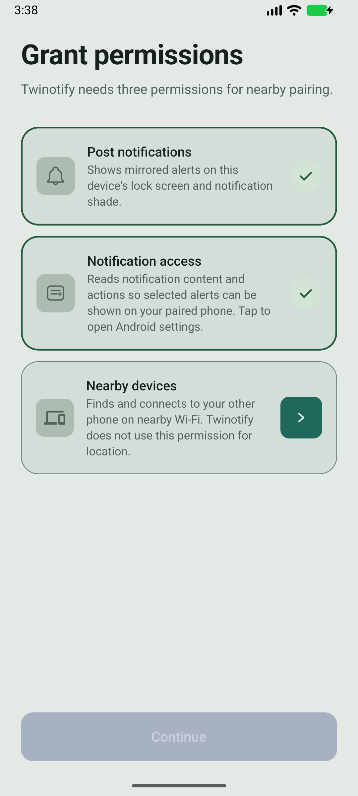

### 5. Android permission handoff — healthy on the emulator

The Android **Nearby devices** prompt appeared only after its explanatory card. Granting it returned to a completed three-card state with **Continue** enabled.

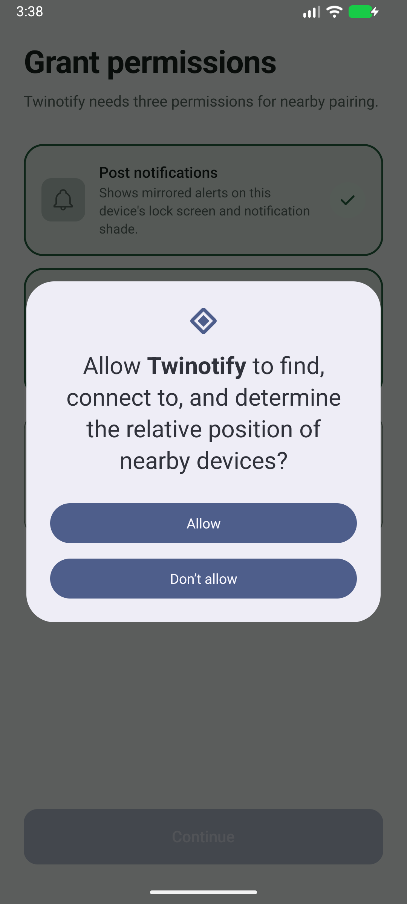

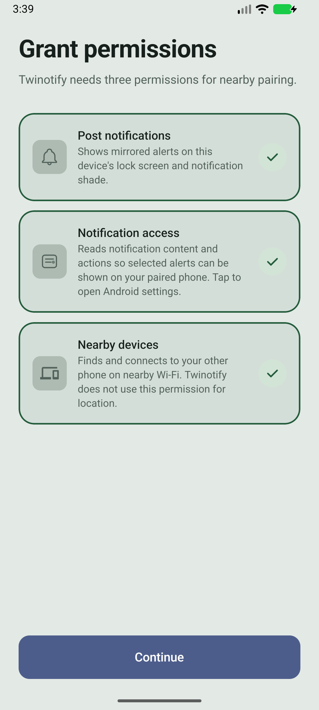

### 6. Background reliability — copy fixed; OEM proof pending

The button opens Android app info, not a vendor-neutral battery screen. The guidance now tells the user to choose **App battery usage** from that destination and warns that wording varies. Actual menu names and auto-start controls still require checks on the owner's physical phones.

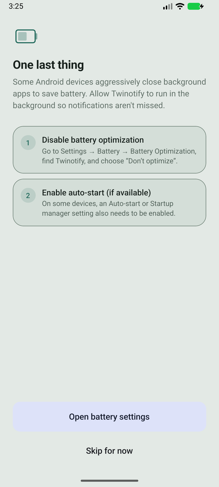

### 7. Ready to pair — emulator gate passed; two-phone success pending

On a clean install, the complete nearby path reached a live QR with “Waiting for the other phone to scan…” instead of `wifi_permission_denied`. The QR itself is deliberately not saved because it contains short-lived pairing material. Scanning, matching the six-digit fingerprint, successful commit, and recovery from peer-side errors require a second device.

### 8. Home while unpaired — healthy

The disabled mirroring switch matches the unpaired state, “Link a device” is the primary action, and zero/no-data metrics are not presented as successful delivery.

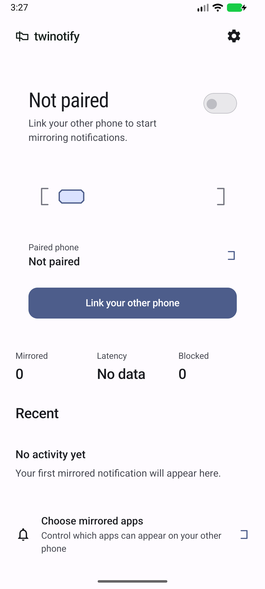

### 9. Settings while unpaired — healthy for reachable state

Labels are plain and the relay choice remains optional. Paired-device status, unpair confirmation, restoration warnings, and route failover cannot be reviewed from the single unpaired emulator state.

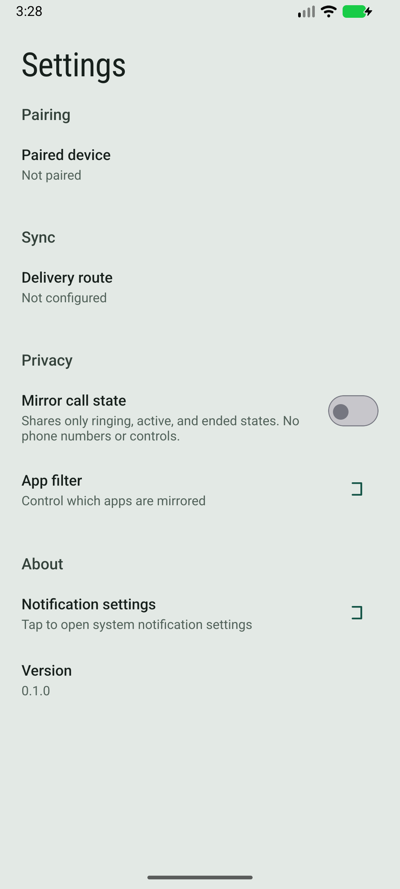

### 10. History and privacy controls — healthy

The empty state explains future content and provides a route to app selection. Disabling stored titles/previews asks for confirmation and clearly distinguishes content deletion from retained delivery metadata.

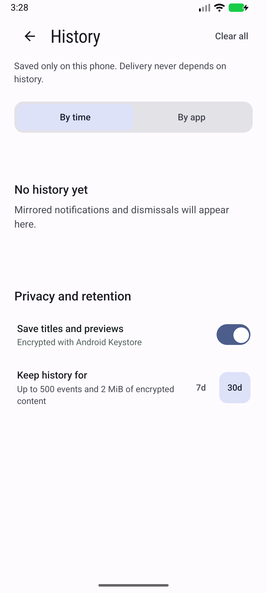

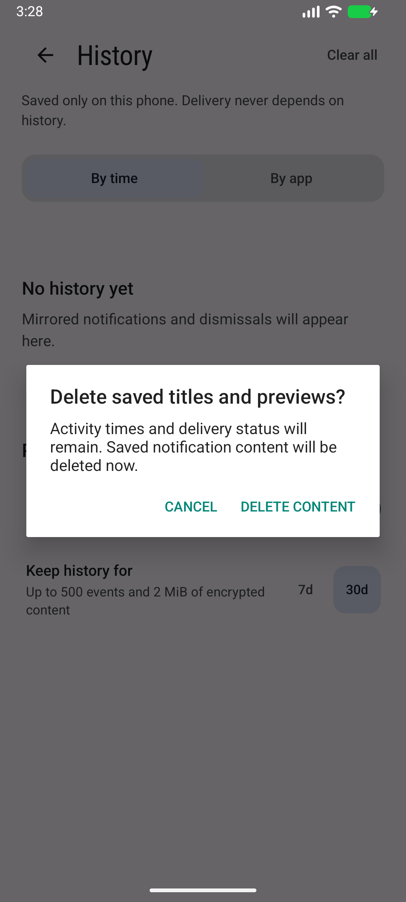

### 11. Dark mode and 160% text — healthy in sampled states

Welcome, unpaired Home, and the corrected three-permission screen remain readable and actionable. The permission page scrolls, and all three cards plus **Continue** remain reachable at 160% text. This is a layout audit, not a claim of formal contrast conformance or TalkBack success.

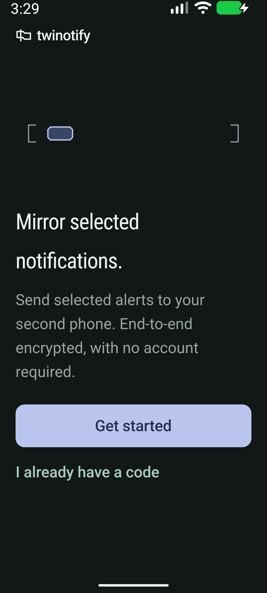

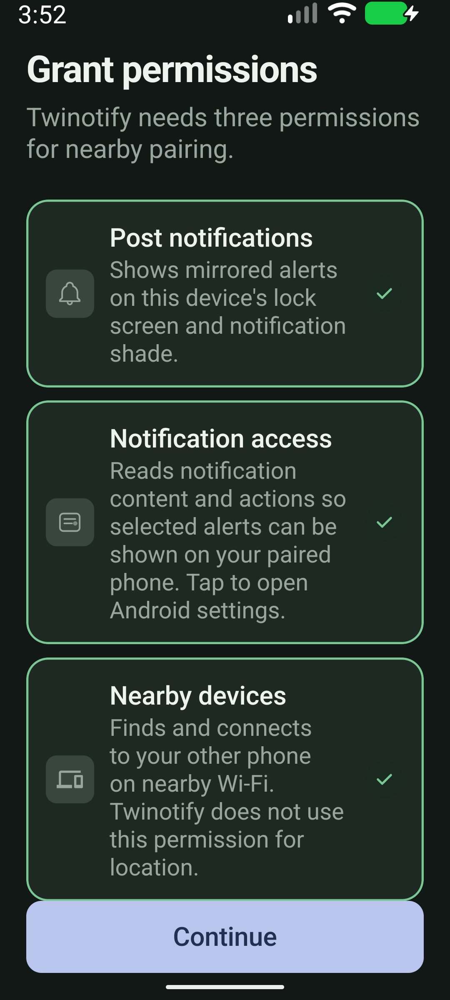

## Findings and disposition

| Severity | Finding | Disposition |
| --- | --- | --- |
| Critical | Nearby onboarding omitted the runtime permission required by the selected path. | Fixed and verified through the Android prompt and QR/waiting state. |
| High | The target-36 manifest opted into the target-37 `ACCESS_LOCAL_NETWORK` contract, producing contradictory cached permission state during the audit. | Removed; a source regression test and clean-install emulator run cover the boundary. |
| Medium | Permission chevrons were unnamed 36 dp controls. | Fixed with descriptive accessibility labels and 48 dp targets. |
| Medium | “Every notification” contradicted filtering/selection. | Fixed to “selected notifications.” |
| Medium | “Twinotify never sees your notifications” overstated the trust boundary of an app that processes data locally. | Fixed to the end-to-end claim the implementation supports: only paired phones can read sent content. |
| Medium | The battery action label promised a screen it did not open. | Fixed to “Open app settings,” with an accurate next step. |
| Medium | A user who cannot use the camera has no secure manual pairing fallback. | Added as PB-010; security and UX design require owner approval. |
| High | A default cross-network consumer relay is unavailable. | Remains PB-005, blocked on owner-controlled service and policy decisions. |

## Evidence limits

This audit does **not** mark the following as passed:

- a complete two-phone nearby or relay pairing, fingerprint comparison, mirrored notification, remote dismissal, unpair, or automatic recovery;
- notification-shade title, grouping, tap target, action, self-notification, and lock-screen behavior on physical Android devices;
- TalkBack traversal/announcements, switch control, one-handed reach, camera focus, haptics, or motion-reduction behavior;
- MIUI/Pixel launcher theming, OEM battery optimization, auto-start, restart, and package-update behavior;
- production relay onboarding, because its hostname and operating/privacy policy remain owner decisions.

All PNGs in this directory were captured during this audit run. The security-sensitive pairing QR was verified through the accessibility tree and intentionally not captured.
